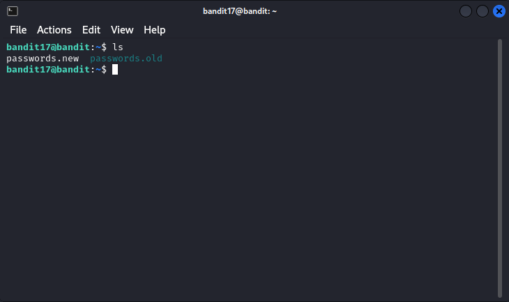

# Level 17 → 18

## Level Goal

There are 2 files in the homedirectory: <mark style="color:orange;">passwords.old</mark> and <mark style="color:orange;">passwords.new</mark>. The password for the next level is in <mark style="color:orange;">passwords.new</mark> and is the only line that has been changed between passwords.old and passwords.new

**NOTE: if you have solved this level and see ‘Byebye!’ when trying to log into bandit18, this is related to the next level, bandit19**


## Write-Up

1. List the content of the directory:

```sh
ls
```

<figure><figcaption></figcaption></figure>

This showed two files: <mark style="color:orange;">passwords.new</mark> and <mark style="color:orange;">passwords.old</mark>

2. Use `diff` to compare the two files:

```bash
diff passwords.old passwords.new
```

<figure><figcaption></figcaption></figure>

This shows which line was changed between the two files.

3. The output showed the old and new passwords, with the new password being the one for the next level:

<mark style="color:orange;">x2gLTTjFwMOhQ8oWNbMN362QKxfRqGlO</mark>

4. Use the new password to access the next level:

```bash
ssh bandit18@bandit.labs.overthewire.org -p 2220
```

<figure><figcaption></figcaption></figure>


## Lessons Learned

* The `diff` command is effective for identifying changes between Files
* File comparison is more reliable than manual inspection for finding differences


\-- Othmane

