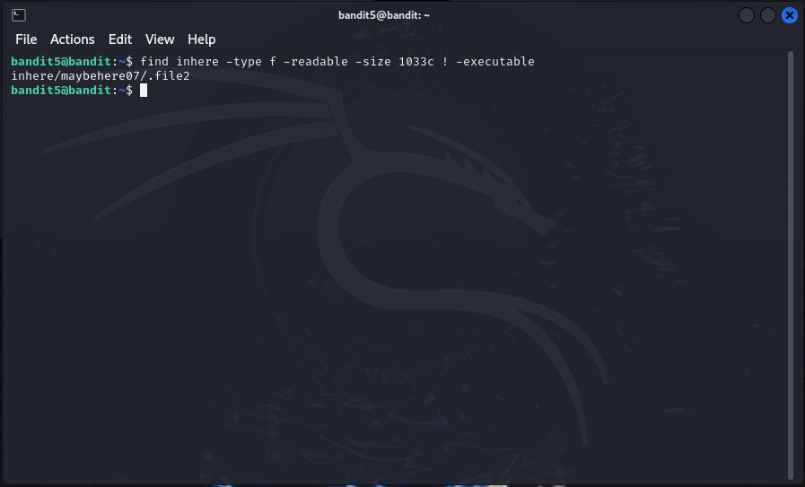

# Level 7 → 8

## Level Goal

The password for the next level is stored in the file <mark style="color:orange;">data.txt</mark> next to the word <mark style="color:orange;">millionth</mark>


## Write-Up

1. List the content of the current directory:

```sh
ls
```

<figure><figcaption></figcaption></figure>

This confirms the presence of the <mark style="color:orange;">data.txt</mark> file.

2. Display the contents of data.txt:

```sh
cat data.txt
```

<figure><figcaption></figcaption></figure>

This file contains a large amount of text, making manual search impractical.

3. Search for the line containing 'millionth' in data.txt:

```sh
grep millionth data.txt
```

<figure><figcaption></figcaption></figure>

* `grep`: Command for searching text using patterns
* `millionth`: The pattern we're searching for
* `data.txt`: The file we're searching in

The password retrieved: <mark style="color:orange;">dfwvzFQi4mU0wfNbFOe9RoWskMLg7eEc</mark>

4. Access the next level:

```sh
ssh bandit8@bandit.labs.overthewire.org -p 2220
```

Enter the password when prompted.


## Lessons Learned

This level taught us how to find specific information in a large file quickly. Using `grep` to search for a keyword is much faster than scrolling through the entire file manually. It's a simple but effective technique that could save a lot of time when dealing with big datasets or logs.


\-- Othmane


