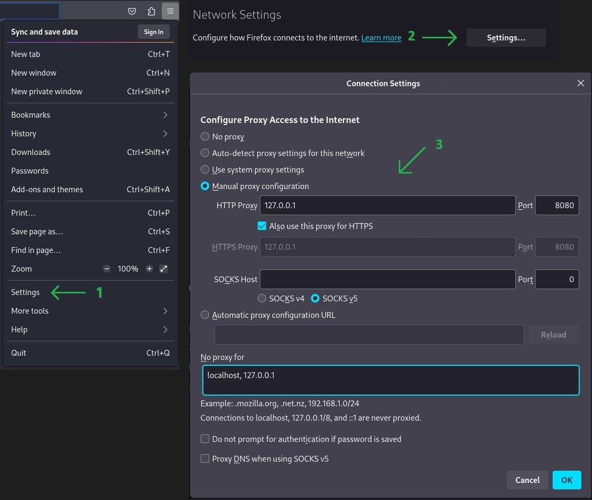

# Information Gathering (Reconnaissance)

## Passive Recon

**Physical Engagement/Social Engineering:**

* Location Information:
  * Satellite images
  * Drone recon
  * Building layout (badge readers, break areas, security, fencing)
* Job Information:
  * Employees (name, job title, phone number, manager, etc.)
  * Pictures (badge photos, desk photos, computer photos, etc.)


**Web/Host:**

* Target Validation: [WHOIS](https://who.is), [nslookup](https://www.nslookup.io), [dnsrecon](https://www.kali.org/tools/dnsrecon)
* Finding Subdomains: [Google FU](https://github.com/champmq/GoogleFU), [dig](https://toolbox.googleapps.com/apps/dig), [Nmap](https://nmap.org), [Sublist3r](https://www.kali.org/tools/sublist3r), [Bluto](https://github.com/darryllane/Bluto), [crt.sh](https://crt.sh)
* Fingerpriting: [Nmap](https://nmap.org), [Wappalyzer](https://www.wappalyzer.com), [WhatWeb](https://whatweb.net), [BuiltWith](https://builtwith.com), [Netcat](https://sectools.org/tool/netcat)
* Data Breaches: [HaveIBeenPwned](https://haveibeenpwned.com), [Breach-Parse](https://github.com/hmaverickadams/breach-parse), [WeLeakInfo](https://weleakinfo.io)


## Identifying The Target

Use [Bugcrowd](https://bugcrowd.com) (a public Bug Bounty Program) to identify the target T-Mobile.

<figure><figcaption><p><a href="https://bugcrowd.com/engagements/t-mobile">https://bugcrowd.com/engagements/t-mobile</a></p></figcaption></figure>

Read the program details carefully and ensure that your testing activities comply with the authorized targets and rules outlined.


## Discovering Email Addresses

[Hunter.io](https://hunter.io) - find and verify professional email addresses

<figure><figcaption><p><a href="https://hunter.io/try/search/t-mobile.com?locale=en">https://hunter.io/try/search/t-mobile.com?locale=en</a></p></figcaption></figure>


[Phonebook.cz](https://phonebook.cz) - lists all domains, email addresses, or URLs for the given input domain.

[Voila Norbert](https://www.voilanorbert.com) - great for getting the email addresses you need.

[Clearbit](https://clearbit.com) - free, verified B2B emails (it has to be used on Chrome).

[Email Hippo](https://tools.emailhippo.com) - free online email verification tool.


## Gathering Breached Credentials with Breach-Parse

[breach-parse](https://github.com/hmaverickadams/breach-parse) - a tool for parsing breached passwords

```sh
breach-parse @t-mobile.com t-mobile.txt "~/Downloads/BreachCompilation/data"
```

The obtained results can be leveraged for Credential Stuffing and Password Spraying.


## Hunting Breached Credentials with DeHashed

[DeHashed](https://dehashed.com) - Have you been compromised? DeHashed provides free deep-web scans and protection against credential leaks.

<figure><figcaption><p><a href="https://dehashed.com/">https://dehashed.com</a></p></figcaption></figure>

Hashes.org is down, therefore, use [Hashes.com](https://hashes.com/en/decrypt/hash) or other tools to decrypt the hashed passwords.


## Hunting Subdomains

[Sublist3r](https://www.kali.org/tools/sublist3r) - Finding Subdomains

1. Synchronize the local package database with repository sources:

```sh
sudo apt update
```

2. Install Sublist3r tool:

```sh
sudo apt install sublist3r
```

3. Run Sublist3r:

```sh
sublist3r -d t-mobile.com
```

<figure><figcaption></figcaption></figure>

This enumerates subdomains of <mark style="color:orange;">T-Mobile.com</mark> using various search engines.


[crt.sh](https://crt.sh) - to look for registered certificates

<figure><figcaption></figcaption></figure>

<figure><figcaption></figcaption></figure>


[OWASP Amass](https://github.com/owasp-amass/amass) - In-depth attack surface mapping and asset discovery

1. Install the GCC-based compiler for the `Go` programming language:

```sh
sudo apt install gccgo-go
```

2. Install the official `Go` programming language compiler and tools developed by Google:

```sh
sudo apt install golang-go
```

3. Install OWASP Amass:

```sh
go install -v github.com/owasp-amass/amass/v4/...@master
```

4. Run OWASP Amass:

<figure><figcaption></figcaption></figure>

5. Enumerate subdomains of <mark style="color:orange;">T-Mobile.com</mark>:

<figure><figcaption></figcaption></figure>


[httprobe](https://github.com/tomnomnom/httprobe) - Take a list of domains and probe for working HTTP and HTTPS servers

1. Install httprobe:

```bash
sudo apt install httprobe
```

2. Run httprobe with <mark style="color:orange;">domains.txt</mark>:

```bash
cat ~/Desktop/domains.txt | httprobe
```

<figure><figcaption></figcaption></figure>

This will narrow the list to the active subdomains.


## Identifying Website Technologies

[BuiltWith](https://builtwith.com) - Web technology information profiler tool. Find out what a website is built with.

<figure><figcaption><p><a href="https://builtwith.com/">https://builtwith.com</a></p></figcaption></figure>

This will display a detailed list of technologies <mark style="color:orange;">T-mobile.com</mark> is built with:

* Analytics and Tracking
* Widgets
* Language
* Frameworks
* Mapping
* Content Delivery Network
* Mobile
* Payment
* Audio / Video Media
* Content Management System
* JavaScript Libraries and Functions
* Verified Link
* Advertising
* SSL Certificates
* Name Server
* Email Hosting Providers
* Web Hosting Providers
* Web Servers
* Operating Systems and Servers
* Verified CDN
* Robots.txt
* Web Master Registration
* Content Delivery Network


Preview of <mark style="color:orange;">Analytics and Tracking</mark>:

<figure><figcaption><p><a href="https://builtwith.com/t-mobile.com">https://builtwith.com/t-mobile.com</a></p></figcaption></figure>


[Wappalyzer](https://www.wappalyzer.com) - Identify technologies on websites

<figure><figcaption></figcaption></figure>


[WhatWeb](https://www.kali.org/tools/whatweb) - Next generation web scanner version

<figure><figcaption></figcaption></figure>

```bash
whatweb t-mobile.com
whatweb tmobile.com
```

<figure><figcaption></figcaption></figure>


## Information Gathering with Burp Suite

[Burp Suite](https://portswigger.net/burp) - The class-leading vulnerability scanning, penetration testing, and web app security platform. Burp Suite's main feature is the Proxy. The Proxy enables Burp to act as an intermediary between the client (web browser) and the server hosting the web application.

1. Set up Firefox for using Burp Suite:

<figure><figcaption></figcaption></figure>

2. Access `https://burp` and download the `CA Certificate`:

<figure><figcaption></figcaption></figure>

3. Import the `CA Certificate`:

<figure><figcaption></figcaption></figure>

4. Access `T-Mobile.com` through Firefox:

<figure><figcaption></figcaption></figure>

Here we can find very useful information.


## Google Fu

Google-Fu (uncountable) (informal) A skill in using search engines (especially Google) to quickly find useful information on the Internet.

[Google Search Operators (Dorks)](https://ahrefs.com/blog/google-advanced-search-operators) - The Complete List (44 Advanced Operators)

Example:

```
site:t-mobile.com -www filetype:pdf
```

* `site:t-mobile.com`: Restricts search to t-mobile.com and its subdomains
* `-www`: Excludes results from www.t-mobile.com
* `filetype:pdf`: Returns only PDF files


## Utilizing Social Media

Social media platforms like [LinkedIn](https://www.linkedin.com), [Twitter (X)](https://x.com), [Facebook](https://www.facebook.com), [Instagram](https://www.instagram.com), etc. are valuable resources for conducting Open-Source Intelligence (OSINT) gathering through publicly available information.


## Additional Learning, Open-Source Intelligence (OSINT)

On a separate page: [Open-Source Intelligence (OSINT)](../open-source-intelligence-osint.md)


